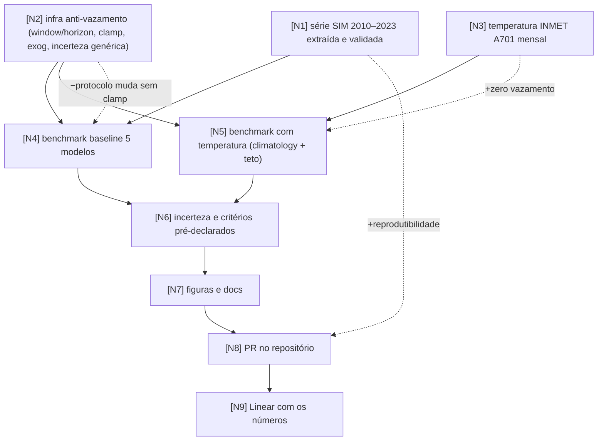

# Task Graph: série 2010–2023, incerteza e temperatura exógena sem vazamento

> Rodada de 17/08/2026, a partir do commit `db37dae` (branch `fabianofilho/incerteza-benchmark`), executada via fork `isasaade-23`, PR #2. Este arquivo é a fonte da verdade da rodada; o da rodada de 01/08 (`task-graph.md`) permanece intacto.
> Página do grafo: `graphs/task-graph-2010-2023.html` (espelho do artifact publicado no update do Linear).

## Objetivo

A rodada de 01/08 mediu a incerteza e concluiu que, com 60 meses, o ranking entre TimesFM, SARIMA e Prophet está dentro do ruído, e que estender a série era pré-requisito de qualquer comparação. Esta rodada executa as Prioridades 1 e 2 do TODO: série SIM 2010–2023 (168 meses) e temperatura como exógena, com a restrição de zero vazamento de dados.

Métricas em tensão: **comparabilidade contra correção de protocolo** (remover o clamp assimétrico muda o protocolo no meio do caminho; mitigado medindo o efeito: zero ocorrências nesta série), **ganho de exógena contra vazamento** (temperatura futura não é conhecida em produção; mitigado com a política climatology, que só usa dados até o fim de cada treino, e o cenário-teto rotulado), e **reprodutibilidade contra política de dados do repo** (a série agregada foi versionada em `results/series/`, onde o `.gitignore` já permite; `data/processed/` segue decisão do dono, LAB-62).

## Grafo

## Nós

| id | descrição | métrica de sucesso | entregável | resultado medido | status |
|----|-----------|--------------------|------------|------------------|--------|
| N1 | extrair e validar a série real SIM SP 2010–2023 | 168 meses contínuos, validador 9/9, reconciliação ≤1% com a rodada anterior | `results/series/serie_eventos_sp_sim_real_2010_2023.csv` + metadata + `results/data_reality_report_2010_2023.json` | 168 meses sem gap, 9/9 checks, divergência **0,000%** nos 36 meses comuns com o `y_true` antigo. Totais anuais suaves (80k→99k), sem degrau de cobertura | done |
| N2 | infra anti-vazamento e rastreabilidade | predictions.csv com `window/horizon/train_end`; clamp assimétrico removido; `run_uncertainty.py` genérico reproduzindo 01/08 | commits em `scripts/run_benchmark.py`, `src/cv_timeseries/models.py`, `scripts/run_uncertainty.py` | reprodução **exata** dos números de 01/08 no CSV antigo (TimesFM 7,30 [6,38, 8,34] etc.); warning diagnóstico que substituiu o clamp disparou 0 vezes nesta série | done |
| N3 | temperatura mensal como exógena candidata | tmin 2010–2023 sem buraco, gates de qualidade (≥18h/dia, ≥20 dias/mês, ≤2 meses interpolados) | `scripts/fetch_temperature_inmet.py`, `results/series/temperatura_sp_mensal_2010_2023.csv` | 168 meses só da estação A701, zero interpolação, zero fallback. tmin médio 16,8°C [11,0–21,2] | done |
| N4 | benchmark baseline com 5 modelos | 103 janelas × 6 = 618 previsões, `n_predictions` idêntico entre modelos | `results/benchmark_sim_real_sp_2010_2023_{metrics,predictions}.csv` | Prophet 4,70 · SARIMA 4,80 · TimesFM 4,83 · CatBoost 6,59 · XGBoost 6,94 (sMAPE %). Zero falhas de janela, pareamento perfeito | done |
| N5 | benchmark com temperatura, políticas com e sem vazamento | mesmas janelas do baseline; climatology monta o futuro só com dados até o fim do treino; observed rotulado como teto | `results/benchmark_exog_temp_{climatology,observed}_{metrics,predictions}.csv` | sarima_temp 4,66 · catboost_temp 6,33 · xgboost_temp 6,55 (climatology). Teto ganha ~0,03 pp sobre a climatologia: o sinal da temperatura mensal é a própria sazonalidade | done |
| N6 | incerteza e veredicto por critérios pré-declarados | bootstrap B=10.000 por janela inteira + DM por horizonte; critérios escritos antes do resultado | `results/uncertainty_2010_2023_*.csv`, `results/uncertainty_exog_climatology_*.csv` | top-3: 6/6 ICs pareados contêm zero (p 0,17–0,77), DM ns em 6/6 horizontes; **empate**, e o ranking pontual inverteu vs 01/08. Boosting pior com p=0,000 e DM<0,05 em 6/6. Temperatura: ICs excluem zero (−0,14 a −0,38 pp) mas DM em ≤2/6 horizontes; **sugestiva, não confirmada** | done |
| N7 | figuras 100% observadas e docs no padrão | recálculo independente de MAE/RMSE/sMAPE batendo em todas as células antes da escrita | `images/fig*_2010_2023.png`, `docs/experiments/benchmark_2010_2023_baseline.md`, `docs/experiments/benchmark_boosting_temperatura.md`, `scripts/generate_figures_2010_2023.py` | 11 de 11 células batendo; 6 figuras geradas só com dado observado, na paleta da identidade visual; nenhuma figura ou doc antigo sobrescrito | done |
| N8 | versionar via fork + PR sem tocar no que é do dono | PR sobre `fabianofilho/incerteza-benchmark`; README/paper/TODO/imagens antigas intactos | PR #2, commits `8bfa940`→`0adb90c` | PR aberto com 6 commits temáticos; decisões LAB-62 (dados) e LAB-64 (redação) explicitamente deixadas para o dono | done |
| N9 | levar os números ao Linear, identificado como versão | update de projeto + comentários LAB-62/63, nada existente editado, reversível (post próprio pode ser apagado) | update + comentários no projeto CPT | rascunhos prontos, aguardando aprovação humana | pending |

## Efeitos colaterais auditados

| aresta | risco | mitigação / aceite |
|--------|-------|--------------------|
| N2 -.->\|−protocolo\| N4 | remover o clamp muda o protocolo entre rodadas; números poderiam divergir por artefato de código, não de dado | o clamp era assimétrico (Prophet/TimesFM nunca o tiveram); mantê-lo contaminava a comparação. Efeito medido: o warning diagnóstico substituto disparou 0 vezes na série 2010–2023; nesta série a remoção é nula na prática |
| N3 -.->\|+zero vazamento\| N5 | efeito positivo: a política climatology recalcula a média do mês-do-ano por janela, truncada no fim do treino | regra dura no código (`build_exog_frames`): o futuro nunca é montado do CSV completo. O cenário observed existe, deliberado e rotulado, apenas como teto |
| N1 -.->\|+reprodutibilidade\| N8 | efeito positivo: série agregada versionada torna o benchmark reproduzível de clone limpo | versionada em `results/series/` (168 linhas `date,value`, sem microdado), onde o `.gitignore` já permite; abrir exceção em `data/` continua sendo decisão do dono (LAB-62) |

## Ordem de execução

1. N1 ∥ N2 ∥ N3 (paralelos)
2. N4 ∥ N5
3. N6
4. N7
5. N8
6. N9

## Log de replanejamento

- **17/08/2026, durante N2:** os scripts da rodada de 01/08 (`run_uncertainty.py` etc.) não estavam na `main` do GitHub; vivem na branch `fabianofilho/incerteza-benchmark`, não mesclada. A rodada inteira passou a partir dessa branch, e o PR aponta para ela como base.
- **17/08/2026, durante N2:** skforecast 0.23 renomeou `regressor` para `estimator` no `ForecasterRecursive`. Corrigido passando o regressor como argumento posicional, compatível com as duas APIs. Correção de API, não muda o grafo.
- **17/08/2026, durante N4:** decisão de `min_train_size=60` (5 anos, ≥4 ciclos sazonais efetivos após a dupla diferenciação do SARIMA), contra os 24 do README/paper e 36 do default antigo do script. A divergência histórica está registrada nos docs; README/paper não foram tocados (LAB-64).
- **17/08/2026, durante N6:** o recorte comparável (mesmas datas de teste 2021–2023) mostrou que 9 anos extras de treino compram 1,2–1,7 pp de sMAPE; mais que toda a amplitude de 0,38 pp que sustentava o claim antigo. O sMAPE agregado de 4,7–4,8% não é comparável com os 7,3% antigos (2015–2019 foi mais fácil); a comparação limpa é o recorte.
- **17/08/2026, durante N7:** paleta das figuras trocada para a identidade visual da executora (azul-ardósia + coral + âmbar), com pares adjacentes validados para visão normal e daltonismo; âmbar nunca adjacente ao coral. As figuras antigas do repositório não foram alteradas.
