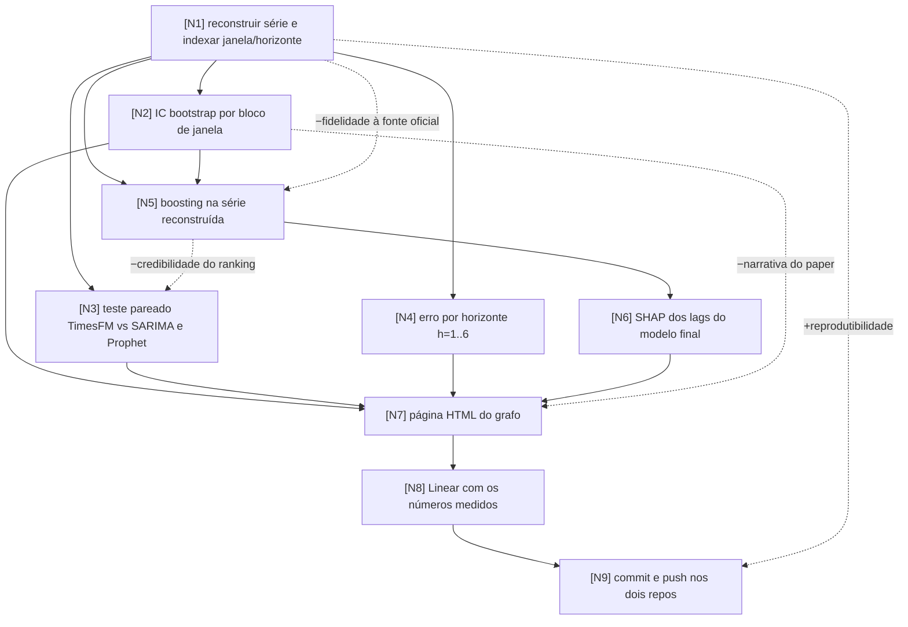

# Task Graph: incerteza do benchmark CV e boosting na série reconstruída

> Gerado pela skill `graph-init`, sob o workflow do `ai-lab-hub`. Este arquivo é a fonte da verdade da tarefa: todo update de status acontece aqui.
> Rodada de 01/08/2026, a partir do commit `801becf`.

## Objetivo

O benchmark publicado dá TimesFM à frente do SARIMA por 0,15 pp de sMAPE, sem nenhuma medida de incerteza, e o `paper.md` já está escrito em cima dessa ordem. Esta rodada mede a largura do intervalo antes de comparar mais nada, e só depois testa boosting.

Métricas em tensão: **rigor estatístico contra a narrativa já escrita** (se o IC engolir a diferença, a conclusão do paper cai), **número de famílias comparadas contra credibilidade do ranking** (aprendizado 5 do `ai-lab-hub`: amplitude entre famílias menor que a largura do IC vira ruído), e **reprodutibilidade contra fidelidade à fonte** (a série real não está versionada, LAB-62, e a reconstrução cobre 36 dos 60 meses).

## Grafo

## Nós

| id | descrição | métrica de sucesso | entregável | resultado medido | status |
|----|-----------|--------------------|------------|------------------|--------|
| N1 | reconstruir a série observada e o índice janela/horizonte a partir de `results/benchmark_sim_real_sp_2019_2023_predictions.csv` | 36 datas únicas de 2021-01 a 2023-12 com `y_true` único por data, 31 janelas x 6 horizontes por modelo, e MAE/RMSE/sMAPE recalculados batendo com o CSV oficial na 2ª casa decimal | `scripts/rebuild_series_from_predictions.py`, `data/processed/serie_sim_sp_2021_2023_reconstruida.csv` | 36 meses recuperados, 31x6 confirmado nos 3 modelos, 9 de 9 métricas batendo na 4ª casa. Média do subperíodo 8.001 óbitos/mês. O CSV é gerado mas não versionado, porque `.gitignore` exclui `data/processed/*`: quem clona roda o script | done |
| N2 | IC95% de sMAPE e MAE por modelo, bootstrap com reamostragem de janelas inteiras | IC calculado para os 3 modelos e largura do IC reportada em pp, comparável à amplitude de 0,38 pp entre modelos | `results/uncertainty_bootstrap_metrics.csv` | TimesFM 7,30 [6,38, 8,34]; SARIMA 7,45 [6,20, 8,92]; Prophet 7,68 [6,49, 9,16]. Largura média 2,45 pp contra amplitude de 0,38 pp, razão 0,16 | done |
| N3 | diferença pareada TimesFM menos SARIMA e menos Prophet, por bootstrap pareado e Diebold-Mariano com correção de Harvey | IC95% da diferença e p-valor para cada par, com veredicto binário: o zero está dentro do intervalo ou não | `results/uncertainty_pairwise_tests.csv` | os 6 IC de diferença contêm zero. TimesFM menos SARIMA: −0,154 pp [−1,429, 1,068], p=0,809. Nos 18 testes DM, só 1 célula abaixo de 0,05, compatível com acaso | done |
| N4 | decompor o erro por horizonte de previsão | sMAPE por modelo e por h de 1 a 6, n=31 por célula, e identificação de em qual h a ordem entre modelos se inverte | `results/error_by_horizon.csv` | a ordem inverte em 5 dos 6 horizontes. SARIMA vence h1, h5 e h6; Prophet vence h2 e h3; TimesFM vence só h4 | done |
| N5 | XGBoost e CatBoost na série reconstruída, mesmo protocolo rolling origin, horizonte 6 | rodou com o número de janelas que a série de 36 meses permite, com esse n declarado no CSV, e sMAPE reportado ao lado da largura de IC de N2 | `results/benchmark_boosting_reconstruido.csv`, `scripts/run_boosting_reconstruido.py` | 7 janelas x 6 = 42 pontos comuns. CatBoost com lags 1-12 chega a 5,70 contra 5,53 do TimesFM. Amplitude de 2,57 pp contra largura média de 3,15 pp, razão 0,82 | done |
| N6 | importância TreeSHAP dos lags do XGBoost final, com direção | \|SHAP\| médio por lag, sinal da relação lag/contribuição, e comparação de sinal contra regressão linear nos mesmos lags, com divergências marcadas | `results/shap_lags_xgboost.csv` | lag 1 domina (\|SHAP\| 396,5, positivo), lag 12 é o mais fraco dos quatro (122,9). Nenhuma divergência de sinal contra o modelo linear | done |
| N7 | página do grafo com resultado medido nó a nó | resultado principal no topo, grafo interativo com estado por cor, tabela nó a nó, gráficos com IC e linha de referência, seção SHAP, validação por script | `graphs/task-graph.html`, `graphs/README.md` | publicada. Validação no DOM: 9 nós, 16 arestas com path, nada fora do viewBox, nenhuma caixa sobreposta, 5 gráficos renderizados, zero erro de console | done |
| N8 | levar os números para o Linear | issues do projeto CPT atualizadas com o número medido e status update publicado com health coerente com o resultado | comentários e status update no projeto CPT | LAB-64 criada como Urgent; LAB-31, LAB-32, LAB-62 e LAB-63 comentadas; status update com health `offTrack` | done |
| N9 | versionar a rodada | commit e push em `cardiovascular-timeseries-prediction`, e no `ai-lab-hub` apenas o aprendizado de ferramenta, sem dado bruto nem credencial | commits em ambos os repos | `0dd1e2a` e `73db7de` em `fabianofilho/incerteza-benchmark`; no hub, `ca887c6` com os aprendizados 10 e 11, depois de remover o espelho do grafo. Nenhum dado bruto e nenhuma credencial no diff | done |

<!-- status: pending → in_progress → done -->

## Efeitos colaterais auditados

| aresta | risco | mitigação / aceite |
|--------|-------|--------------------|
| N1 -.->\|−fidelidade à fonte oficial\| N5 | a série reconstruída tem 36 meses, não os 60 da extração original, e um modelo treinado nela não é comparável ao benchmark publicado. Pior: alguém pode confundir o CSV reconstruído com a extração oficial do SIM | mitigação: nome de arquivo com sufixo `_reconstruida`, cabeçalho no script dizendo a origem e o recorte, e coluna `n_janelas` no CSV de resultado do boosting. O CSV reconstruído nunca substitui `serie_eventos_sp_sim_real.csv` na LAB-62 |
| N5 -.->\|−credibilidade do ranking\| N3 | acrescentar duas famílias de modelo quando o IC é largo produz ranking que é ruído, exatamente o erro 5 do `aprendizados-pipeline-agentes.md` | mitigação: N2 é dependência dura de N5. Se a diferença medida for menor que a largura do IC, o relatório declara empate e nenhuma ordem entre modelos é afirmada |
| N2 -.->\|−narrativa do paper\| N7 | se o IC engolir os 0,15 pp, a frase "TimesFM vence em todas as métricas" do README e do `paper.md` deixa de se sustentar | mitigação de escopo: esta rodada não reescreve `paper.md`. O achado vira manchete da página, comentário na LAB-32 e decisão explícita para o F, com o número que o sustenta |
| N1 -.->\|+reprodutibilidade\| N9 | efeito positivo: versionar a série reconstruída dá ao repositório 36 meses reproduzíveis | não exige mitigação. Resolve parcialmente a LAB-62 e isso precisa estar dito na issue, para não parecer que a extração oficial foi recuperada |

## Ordem de execução

<!-- saída do AUDIT: ordem topológica das arestas depends_on -->
1. N1
2. N2
3. N3
4. N4
5. N5
6. N6
7. N7
8. N8
9. N9

## Log de replanejamento

<!-- toda dependência/efeito descoberto durante EXECUTE entra aqui, com data -->
- **01/08/2026, durante N5:** o subconjunto de 42 pontos comuns (todo ele em 2023) tem sMAPE bem menor que o conjunto completo: TimesFM faz 5,53 ali contra 7,30 nas 186 previsões. Não é ganho de modelo, é ano mais fácil. Consequência para a leitura: os números da tabela de N5 não podem ser comparados com os de N2, só dentro da própria tabela. Registrado como restrição de interpretação, sem novo nó.
- **01/08/2026, durante N6:** `inplace_predict(predict_type="contribs")` devolve array 1-D nesta versão do XGBoost (3.3.0). Trocado por `Booster.predict(DMatrix, pred_contribs=True)`. Correção de API, não muda o grafo.
- **01/08/2026, depois de N9, por instrução do F:** o `ai-lab-hub` não recebe experimento, só aprendizado de ferramenta que outro experimento do lab consiga aplicar. O espelho do grafo commitado em `_squad/_build/graph.md` foi removido, e o que sobrevive da rodada virou os itens 10 e 11 de `docs/aprendizados-pipeline-agentes.md`: comparar poucos modelos também produz ranking que é ruído, e em série temporal o desenho da reamostragem decide o resultado. O `CLAUDE.md` do hub, que mandava salvar o grafo lá, foi corrigido para apontar o `task-graph.md` do projeto.
- **01/08/2026, durante N9:** o `.gitignore` exclui `data/processed/*` inteiro, não só `data/raw`. Isso responde um item do checklist da LAB-62 e explica a causa raiz: a série nunca deixou de ser versionada por decisão, foi por regra genérica. Consequência para esta rodada: `serie_sim_sp_2021_2023_reconstruida.csv` **não entra no commit**, porque abrir exceção na política de dados do repositório é decisão do F, não do executor. A reprodutibilidade fica garantida pelo script, que regenera o CSV em segundos a partir de artefato versionado. O texto da LAB-62 foi corrigido, porque a primeira redação dizia que o CSV estava no repositório.
- **01/08/2026, após N5:** o efeito colateral `N5 -.-> N3` se confirmou na direção prevista. Com 7 modelos na mesma tabela a amplitude subiu para 2,57 pp, ainda abaixo da largura média de IC de 3,15 pp. A mitigação foi aplicada: nenhuma ordem entre modelos é afirmada no relatório.
